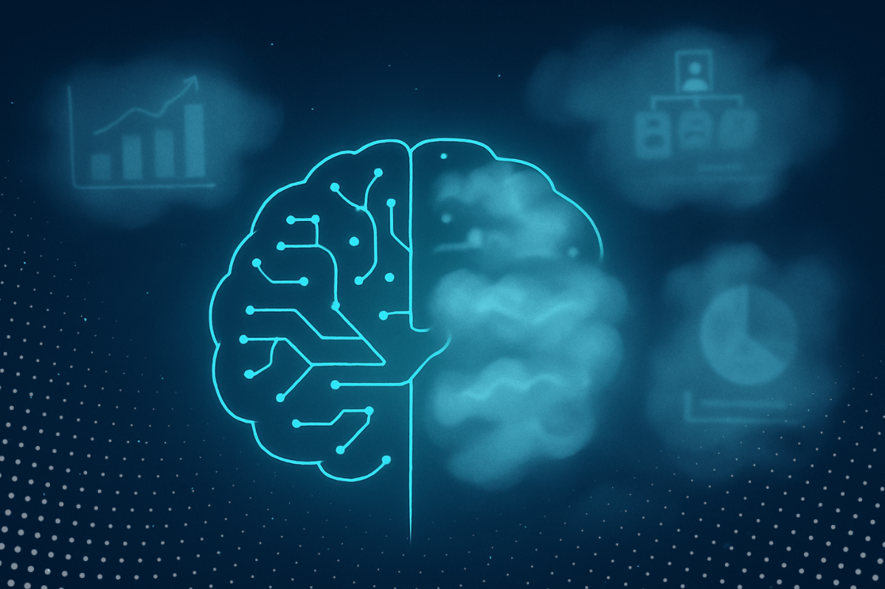
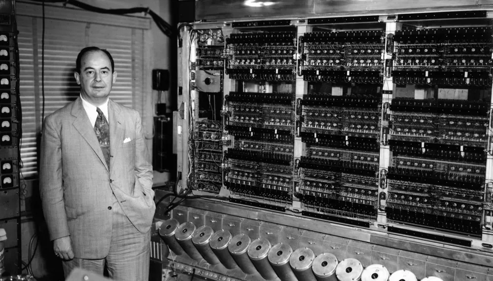
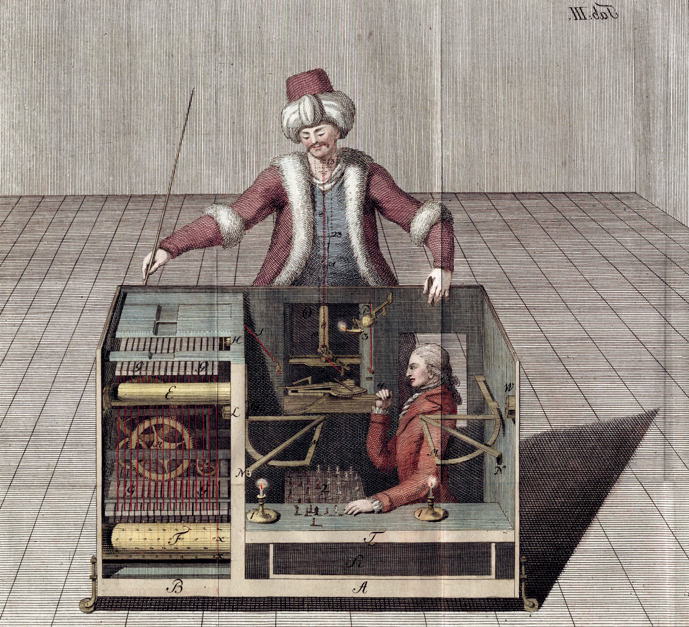

Ce blog est pensé comme un journal intime. J'y rassemblerai de façon structurée les différents questionnements qui jalonnent mes journées de travail. Les sujets traités intersectent le contenu des discussions informelles qui animent les pauses café des laboratoires de mathématiques.

Avant toute chose, c'est un projet "de développement personnel", dont le but principal sera ma progression dans la compréhension des sujets abordés. Le format du blog et son aspect public sont le moyen pour arriver à cette fin: ils me forceront à la rigueur et à la régularité de l'effort. 

Si quelques-uns de mes amis, collègues ou étudiants parcourent ce blog et prennent du plaisir et de l'intérêt à le lire, j'en serai très honoré. Je n'ouvre pas d'espace pour les commentaires dans ce projet. Mais des retours par email ou encore mieux, en personne, seront appréciés, quelle que soit leur teneur.  

## Vertiges et hallucinations mathématiques

Pour qui suit l'actualité mathématique récente (septembre 2026) cet intitulé de blog n'est pas si obscur. Je prends un exemple. 

J'ai encadré en stage ou en mémoire de master une 20aine d'étudiants en mathématiques appliquées. Cette année, mes deux stagiaires ne m'ont pas parlé. Ils ne sont pas venus me poser des questions, ils ne m'ont pas demandé de conseils, ou si peu. À certaines suggestions, ils ont opposé une résistance, parfois un refus à avancer dans la direction proposée. L'explication est pour nous toute simple: ils parlent avec la Machine (c'est-à-dire une IA). Et je les comprends, cette conversation est fascinante ! Moi aussi je lui parle. Sa fiabilité, sa rapidité, son aplomb ne semblent pas avoir de limite. Mais il m'a fallu l'aide de deux collègues pour convaincre un étudiant que sa solution était incomplète, la Machine répondait juste, mais à côté de la vraie question. Une autre fois, je n'ai pas réussi à convaincre un stagiaire que ma question avait de l'intérêt, la Machine lui ayant sans doute expliqué l'inutilité ou l'impossibilité de la question. Comme le résume un collègue, "notre stagiaire est l'intermédiaire entre nous et l'IA". On espère qu'il paye pour un abonnement de qualité... On se demande si sa gratification de stage n'aurait pas été mieux employée par nous dans une souscription au meilleur système d'IA...

**Le vertige**, c'est ce mathématicien talentueux, ce génie de la lampe, cette Machine qui nous dépasse, qui nous fait douter de nos choix mathématiques, qui brise nos intuitions et risque, si nous n'y prenons garde, d'assécher notre créativité. Il est dans notre smartphone, dans notre ordinateur, à portée de main et de clic. En un instant, il nous contredit, nous guide, mais aussi nous décourage à poursuivre notre petite voie.

**L'hallucination**, c'est celle bien connue des réseaux de neurones. C'est ce rêve éveillé (ou peut-être ce cauchemar) qui redessine le paysage de notre métier. À quoi ressemblera l'univers mathématique à notre éveil ? Quelle nouvelle compétence développer ? Comment et quoi enseigner aux étudiants dans ces turbulences ? Aurons-nous encore même des étudiants en mathématiques ? Notre rôle se réduira-t-il à parler à la Machine et à clarifier ses réponses ? (même pas à les vérifier, puisque LEAN le fera pour nous).

Nous sommes bien malgré nous (ou à cause de nous) dans un instant de sidération pour toute la communauté mathématique et scientifique : une Machine raisonne mieux que nous. Comment lui parler ? Faut-il lui parler ? À laquelle de ces Machines parler ? (il existe tant de modèles différents). Quand lui faire confiance ? A quel point se trompe-t-elle sur les questions de niveau recherche ? Où se situe sa limite ? Et quand le saurons-nous ? 

## Can we survive technology? [1]

En vaquant sur le web, je suis tombé sur cette citation de John von Neumann, qui m'a semblé un bon préambule à ce blog. C'est le titre d'un [article](../../documents/von_Neumann_1955.pdf) publié en 1955 dans le magazine Fortune. Ce grand mathématicien et physicien, précurseur de l'informatique, y décrit un monde dans lequel le progrès technologique accroît sans cesse l’échelle et la rapidité de l’action humaine. Il poursuit en notant que les structures géographiques, sociales et politiques actuelles (en 1955) ne sont pas adaptées.

Quelques citations :

::: {.citation}

""The great globe itself" is in a rapidly maturing crisis
—a crisis attributable to the fact that the environment
in which technological progress must occur has become
both undersized and underorganized."

:::

::: {.citation}

"We begin to feel the effects of the finite, actual size of the earth in a critical way."

:::

Il anticipe aussi les effets du réchauffement climatique:

::: {.citation}

"The carbon dioxide released into the atmosphere by industry's burning of coal and oil-—more than half of it during the last generation—may have changed the atmosphere's composition sufficiently to account for a general warming of the world by about one degree Fahrenheit."

:::

Toutefois, et ceci est un aparté, les avertissements des scientifiques quant aux changements climatiques d'origine humaine remontent à bien avant 1955, contrairement à une idée reçue (cf [Histoire de la recherche sur le_changement climatique](https://fr.wikipedia.org/wiki/Histoire_de_la_recherche_sur_le_changement_climatique)). Enfin, Von Neumann développe son texte autour des risques et opportunités de l'énergie nucléaire mais aussi de la géo-ingénierie (la modification du climat global par une intervention technologique locale). Sur ce dernier point, sa prévision est mise en défaut. Mais il nous invite à sa propre modestie :

::: {.citation}

All experience shows that even smaller technological changes than those now in the cards profoundly transform political and social relationships. Experience also shows that these transformations are not a priori predictable and that most contemporary "first guesses" concerning them are wrong.

:::

[1] von Neumann, J. (1955). Can we survive technology? Fortune, 51(6), 106–108.

## Le Turc mécanique, le joueur d'échecs

Le [Turc mécanique](https://fr.wikipedia.org/wiki/Turc_m%C3%A9canique) est un automate joueur d'échecs présenté pour la première fois en 1770 par Wolfgang von Kempelen. Il semblait jouer de manière autonome, mais un joueur humain caché dans le meuble déplaçait réellement les pièces. Cette célèbre mystification a circulé en Europe et en Amérique pendant plusieurs décennies.

La création d'algorithmes plus fort au jeu d'échecs que l'humain n'a pas arrêté le plaisir de jouer aux échecs. De même que la Machine ne remplacera pas le plaisir de faire des mathématiques. Ainsi, ce blog partagera avant tout mon plaisir des mathématiques, de la recherche et de l'enseignement. 

Enfin, faire des mathématiques est pour moi l'exercice ultime de la créativité. C'est mon espoir que la Machine, bien qu'infiniment plus forte à l'interpolation mathématique que je ne le suis, restera limitée par la force de l'imagination humaine qui borne son action. Je me risque à une prédiction hasardeuse, que je propose de tempérer par cette citation attibuée à Niels Bohr:  

::: {.citation}

"Prediction is very difficult, especially about the future."

:::
