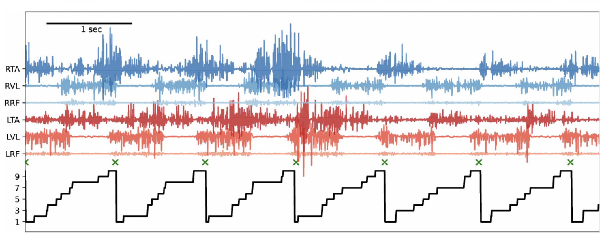
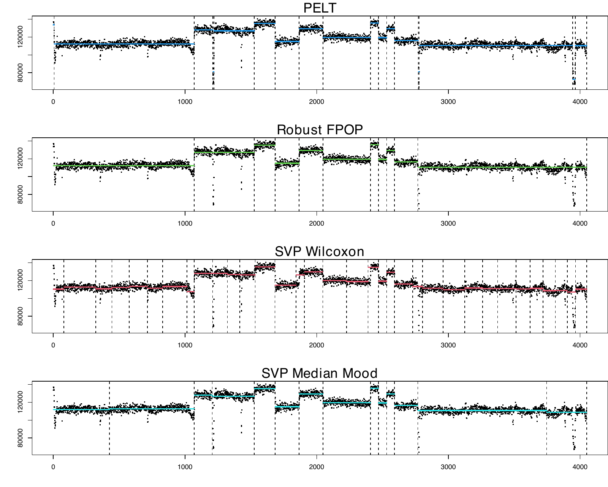
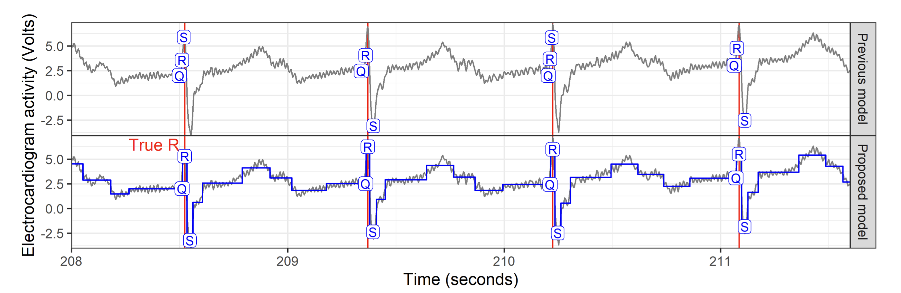
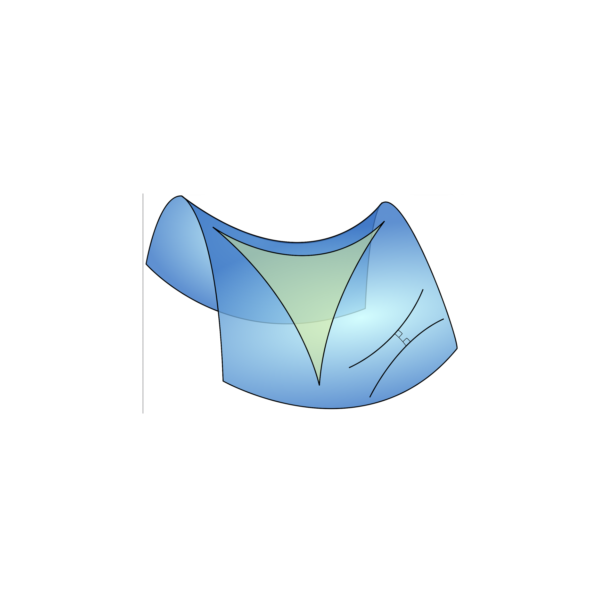
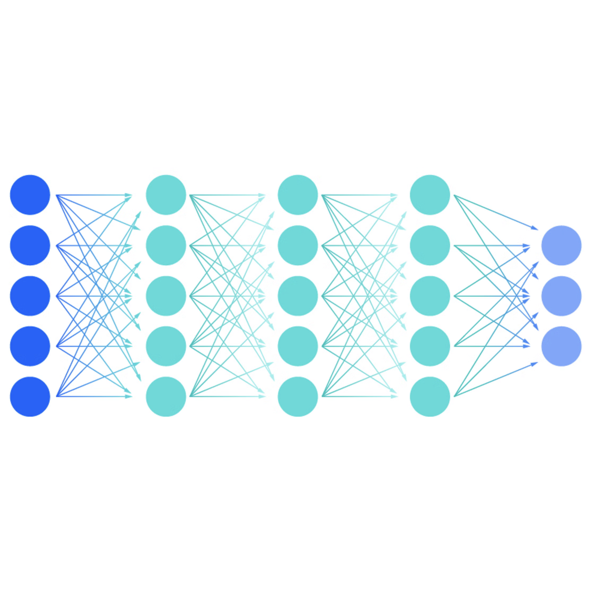
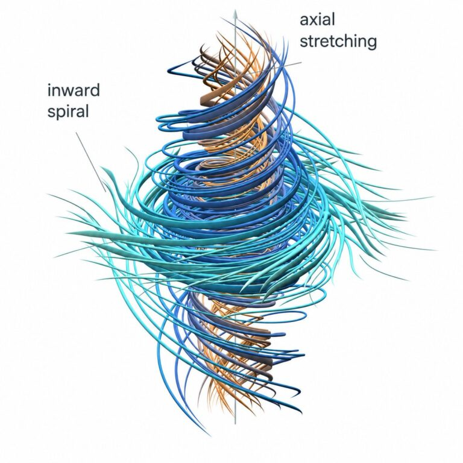
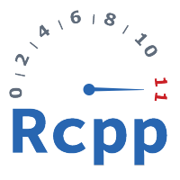

My current research focuses on developing **efficient algorithms** for change-point detection in time series, with particular emphasis on exact methods, structured observations, and geometric ideas.

## Current work: efficient change-point detection

My current research focuses on **multiple change-point detection** and **dynamic programming**. I draw on ideas from *computational geometry* and *duality theory* to improve the computational efficiency of *exact* change-point detection algorithms. This acceleration technique, commonly known as **pruning**, reduces the search space while preserving exactness.

Alongside my work on dynamic programming, I study **statistical guarantees** for change-point detection. *Consistency* and *convergence rates* for change-point estimators provide fundamental guarantees on the reliability of our algorithm. These questions are linked to the **calibration of hyperparameters**, and are crucial for the practical use of change-point detection methods.

::: {.columns .research-figures}
::: {.column width="33%"}
{fig-alt="Six red and blue EMG traces, green crosses at true footstep boundaries, and a black learned state sequence."}

Figure 3 from [HOP article](https://proceedings.mlr.press/v258/kostic25a.html).
:::

::: {.column width="33%"}
{fig-alt="Four segmented views of oil well-log data, with detected change-points shown as vertical dashed lines."}

From [SVP article](https://hal.science/hal-05491126).
:::

::: {.column width="33%"}
{fig-alt="Electrocardiogram trace with Q, R, and S wave labels, detected changepoints, and a piecewise-constant fit."}

From [gfpop article](https://www.jstatsoft.org/article/view/v106i06).
:::
:::

::: {.section-heading-row}
::: {.section-heading-title}
## Beyond Euclidean data
:::

::: {.section-heading-logo}

:::
:::

We extend change-point methods from ordinary Euclidean spaces to more complex, non-Euclidean data structures. This includes work with Hadamard spaces and CAT spaces, where notions of means and segment cost have to be extended. See [HOP publication](https://proceedings.mlr.press/v258/kostic25a.html) and the [CAT spaces preprint](https://hal.science/hal-05535310/).

::: {.section-heading-row}
::: {.section-heading-title}
## Mathematical background
:::

::: {.section-heading-logo}

:::
:::

My background as a PhD student is in partial differential equations and mathematical analysis. The topic was motivated by the 2D free boundary Hele-Shaw problem. I worked with tools from complex analysis and control theory and developed C++ code for numerical simulations in fluid dynamics. This earlier work is documented in the [earlier mathematical publications](publications.qmd#earlier-mathematical-publications) listed on my [Publications page](publications.qmd).

::: {.section-heading-row}
::: {.section-heading-title}
## Broader interests in applied mathematics
:::

::: {.section-heading-logo}

:::
:::

More broadly, I am interested in **applied mathematics** and in developing my research and teaching toward advanced **natural language processing**, **deep learning** and **supervised machine learning**. I am particularly interested in questions of fairness and differential privacy, as these notions are fundamental to the responsible use of machine learning in society. 

::: {.section-heading-row}
::: {.section-heading-title}
## AI-assisted mathematics
:::

::: {.section-heading-logo}

:::
:::

I see AI-assisted mathematics as both a thread and an opportunity. As many of my colleagues, I try to **follow and test** recent developments. However, **I am strongly opposed to using AI to automate the production of reports, publications or peer reviews**. At the same time, I consider AI assistance an inevitable part of mathematical work, for example, as a tool for exploring ideas, polishing proofs, or searching for the key argument when I get stuck. I use it also for improving my written English (as done on this website).

I support the [Human Mathematics Association](https://www.ahmath.org/home) and its efforts to promote the responsible use of AI and prevent its misuse in mathematics.

::: {.section-heading-row}
::: {.section-heading-title}
## Software
:::

::: {.section-heading-logo}

:::
:::

An important part of my time is dedicated to **developing software for change-point detection**, even in this new area of code automation. A task that will become increasingly important in the future is the **standardization** of the many change-point detection software packages.

I develop R packages for change-point detection, including [svpChange](https://github.com/vrunge/svpChange), [DUST](https://github.com/vrunge/dust), [gfpop](https://github.com/vrunge/gfpop) and [slopeOP](https://github.com/vrunge/slopeOP). A complete list of papers, preprints and software is available on the [Publications page](publications.qmd) and the [Software page](software.qmd).

## Applied statistics projects

*Keeping a connection with the application* of our research in statistics and mathematics is **fundamental** in our work. *Listening to the needs of the practitioners* is equally important and is a constant source for us of new ideas and research questions.

- **Antibiogram images:** The SWITCH change-point algorithm measures inhibition-zone diameters from disk-diffusion antibiograms for use in a smartphone application ([study](https://doi.org/10.1038/s41467-021-21187-3)).

- **Mouse behaviour ethogram:** The HOP algorithm represents action syllables from mouse-monitoring data in a tree-structured Hadamard space, compressing 50 syllables into 7 interpretable meta-syllables, including exploration and grooming ([HOP article](https://proceedings.mlr.press/v258/kostic25a.html)).

- **Mouse muscle fatigue:** The fast DUST algorithm detects variance changes in force-platform recordings to distinguish active and resting periods ([DUST preprint](https://arxiv.org/abs/2507.02467)).

- **ECG analysis:** A constrained change-point model in gfpop locates QRS complexes in electrocardiogram waveforms ([gfpop article](https://www.jstatsoft.org/article/view/v106i06)).

- **Bacterial gene expression:** DeCAFS detects abrupt changes in gene-expression levels in *Bacillus subtilis*. More generally, change-point detection is useful for identifying shifts in RNA-seq data ([DeCAFS article](https://doi.org/10.1080/01621459.2021.1909598); [related work](https://academic.oup.com/nargab/article/5/4/lqad098/7369456)).

### Ongoing projects outside of change-point detection

- **Anticholinergic prescriptions:** Descriptive statistics and dose–effect study. Most supervised machine learning tools have been tested. This project is still ongoing and is in collaboration with [Hervé Javelot](https://www.researchgate.net/profile/Herve-Javelot) from the Etablissement Public de Santé Alsace Nord, Brumath (EPSAN). Two mathematics master’s students have already worked with us on this project.

- **Bird vocalization:** In collaboration with [Lorenzo Dubois](https://ear.cnrs.fr/welcome-to-lorenzo-dubois/) at the Muséum National d’Histoire Naturelle (MNHN), Ikram Niari’s 2026 internship analyzed BirdNET detections from the Risoux forest over 2018–2024. The study modeled log-transformed daily detection counts for the European robin (*Erithacus rubecula*) and coal tit (*Periparus ater*) using linear regression with seasonal and weather effects. We identify a long-term trend in vocal activity that could be linked to climate change.
